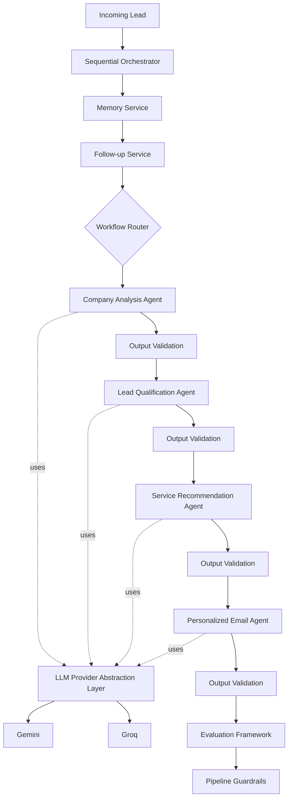

# Autonomous-Outreach-Agent

## Project Overview

Autonomous-Outreach-Agent is a modular AI-powered multi-agent system built with the Google Agent Development Kit (ADK) to automate B2B sales outreach. The system processes company information through a pipeline of specialized AI agents that analyze businesses, qualify leads, recommend AI services, and generate personalized outreach emails.

To improve maintainability and extensibility, each agent is responsible for a single task and communicates using structured schemas rather than unstructured text. Supporting services such as memory management, workflow routing, output validation, evaluation, and pipeline guardrails provide the foundation for evolving the system toward a production-ready architecture.

The project also includes an LLM Provider Abstraction Layer built with LiteLLM, allowing AI agents to use multiple language model providers through a unified interface with automatic provider failover.

## Features

- **Multi-Agent AI Pipeline** – Automates B2B outreach using specialized AI agents, each responsible for a single task.
- **Company Analysis** – Extracts structured business information from company data.
- **Lead Qualification** – Evaluates and prioritizes leads based on predefined qualification criteria.
- **Service Recommendation** – Recommends AI solutions tailored to each company's needs.
- **Personalized Email Generation** – Generates personalized outreach emails using outputs from previous agents.
- **Memory Service** – Maintains lead history and cached AI outputs to support future workflow decisions.
- **Follow-up Service** – Determines whether follow-up outreach is required based on lead history and business rules.
- **Workflow Router** – Selects the appropriate workflow based on the lead's current state.
- **LLM Provider Abstraction Layer** – Provides a unified interface for AI agents to communicate with multiple LLM providers.
- **Automatic Provider Failover** – Uses LiteLLM Router to automatically switch providers when the primary provider is unavailable.
- **Output Validation** – Validates each agent's structured output before it is used by downstream components.
- **Evaluation Framework** – Evaluates the quality of individual agent outputs and the overall AI pipeline.
- **Pipeline Guardrails** – Applies business rules and policy checks before pipeline outputs are used.

## Current Implementation Architecture

The current implementation represents an intermediate stage between the original sequential architecture and the proposed next-generation architecture documented in this repository.

The project currently includes the core AI agent pipeline together with several production-oriented components, including the Memory Service, Follow-up Service, Workflow Router, LLM Provider Abstraction Layer, Output Validation, Evaluation Framework, and Pipeline Guardrails. These additions improve modularity, reliability, and extensibility while maintaining the original sequential orchestration model.

The proposed next-generation architecture described in `docs/architecture/next_generation_architecture.md` includes additional components such as a Message Queue, Workflow Orchestrator, Database, and CRM Integration, which have not yet been implemented.


## AI Pipeline

The AI pipeline follows a sequential execution model in which each specialized agent performs a single responsibility and passes structured outputs to the next stage.

1. **Company Analysis Agent**
   - Analyzes the target company and extracts structured business information.

2. **Lead Qualification Agent**
   - Evaluates the company's potential as a sales lead using the company analysis.

3. **Service Recommendation Agent**
   - Recommends AI services tailored to the company's business needs.

4. **Personalized Email Agent**
   - Generates a personalized outreach email using the outputs from previous agents.

Each agent communicates using structured schemas, enabling reliable data exchange, simplifying validation between stages, and reducing downstream processing errors.

## Project Structure

```text
Autonomous-Outreach-Agent/
├── common/                         # Shared enums and utilities
├── company_analysis_agent/         # Company Analysis Agent
├── lead_qualification_agent/       # Lead Qualification Agent
├── service_recommendation_agent/   # Service Recommendation Agent
├── personalized_email_agent/       # Personalized Email Agent
├── orchestrator/                   # Sequential orchestrator
├── memory_service/                 # Memory service
├── follow_up_service/              # Follow-up service
├── workflow_router/                # Workflow routing
├── llm_provider/                   # LLM provider abstraction layer
├── validation/                     # Output validation
├── evaluation/                     # Evaluation framework
├── guardrails/                     # Pipeline guardrails
├── docs/
│   └── architecture/               # Architecture documentation
└── README.md
```
## Core Components

| Component | Responsibility |
|-----------|----------------|
| **Sequential Orchestrator** | Coordinates the execution of the AI agent pipeline in a sequential workflow. |
| **Company Analysis Agent** | Extracts structured business information about a company. |
| **Lead Qualification Agent** | Evaluates and prioritizes companies based on predefined qualification criteria. |
| **Service Recommendation Agent** | Recommends AI services tailored to the company's business needs. |
| **Personalized Email Agent** | Generates personalized outreach emails using previous agent outputs. |
| **Memory Service** | Stores lead history and cached AI outputs to support future workflow decisions. |
| **Follow-up Service** | Determines whether a follow-up should be initiated based on lead history and business rules. |
| **Workflow Router** | Selects the appropriate workflow based on the lead's current state. |
| **LLM Provider Abstraction Layer** | Provides a unified interface for communicating with multiple LLM providers. |
| **Output Validation** | Validates structured outputs before they are passed to downstream components. |
| **Evaluation Framework** | Evaluates the quality of individual agent outputs and the overall AI pipeline. |
| **Pipeline Guardrails** | Applies business rules and policy checks before pipeline outputs are used. |

## Installation

### 1. Clone the repository

```bash
git clone https://github.com/SanestixLabs/Autonomous-Outreach-Agent.git
cd Autonomous-Outreach-Agent
```

### 2. Create a virtual environment

```bash
python -m venv .venv
```

Activate the virtual environment.

**Windows**

```bash
.venv\Scripts\activate
```

**Linux/macOS**

```bash
source .venv/bin/activate
```

### 3. Install dependencies

```bash
pip install -r requirements.txt
```

> Additional dependencies may be required depending on the components being developed.
```
## Environment Variables

Create a `.env` file and configure the required API keys.

```env
GOOGLE_API_KEY=your_google_api_key
GROQ_API_KEY=your_groq_api_key
```

The LLM Provider Abstraction Layer uses these credentials to communicate with the configured language model providers.

## Running the Project

Start the Google ADK development server from the project root:

```bash
adk web
```

The ADK web interface can then be used to interact with the implemented AI agents during development.

## LLM Provider Abstraction Layer

The project includes a provider abstraction layer that decouples AI agents from individual language model providers.

Instead of interacting directly with a specific provider, each AI agent requests a model through a shared provider interface. This enables centralized provider configuration and simplifies future maintenance.

The abstraction layer currently supports:

- Gemini
- Groq

Provider failover is handled using LiteLLM Router. If the primary provider becomes unavailable, requests are automatically routed to a configured fallback provider without requiring changes to the agent implementations.

## Documentation

Additional project documentation is available in the `docs` directory.

- `docs/architecture/system_architecture.md` — Original system architecture.
- `docs/architecture/next_generation_architecture.md` — Proposed next-generation architecture.

The project also includes Architecture Decision Records (ADRs), which document the major architectural decisions made during development.

## Current Limitations

The current implementation is a functional proof of concept and does not yet include every component proposed in the next-generation architecture.

The following components are planned but have not yet been implemented:

- Message Queue
- Workflow Orchestrator
- Database integration
- CRM integration

These components are described in the proposed architecture documentation and represent future enhancements toward a production-ready system.

