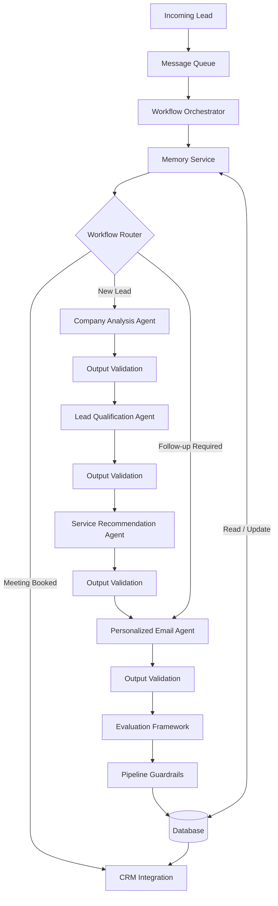

# Autonomous Outreach Agent

# Next-Generation System Architecture (v2)

**Version:** 2.0

**Status:** Proposed Architecture

---

## 1. Overview

This document proposes the next-generation architecture for the Autonomous Outreach Agent.

The objective is to evolve the current proof-of-concept implementation into a production-ready, scalable, and intelligent AI system capable of handling customer history, lead lifecycle management, dynamic workflow execution, and large-scale outreach operations.

The proposed architecture introduces persistent memory, workflow routing, lead state management, and asynchronous processing while preserving the modular multi-agent design of the current system.

---

## 2. Design Goals

The next-generation architecture is designed to achieve the following objectives:

- Improve production readiness.
- Increase scalability for high-volume outreach.
- Eliminate duplicate outreach.
- Introduce persistent customer memory.
- Support lead lifecycle management.
- Enable dynamic workflow execution.
- Reduce unnecessary AI computation through reusable outputs.
- Improve maintainability and extensibility.

---

## 3. Current Challenges

The current implementation has several architectural limitations that prevent it from being deployed as a production system.

### Challenges

- Every lead follows the same sequential workflow.
- The system does not remember previously processed leads.
- Customer interaction history is not stored.
- Duplicate outreach cannot be prevented.
- Lead lifecycle is not tracked.
- AI agents recompute information that may already exist.
- The pipeline executes sequentially and is difficult to scale for high-volume workloads.

---

## 4. Proposed Architecture

---

## 5. Component Responsibilities

| Component | Purpose |
|-----------|----------|
| **Message Queue** | Buffers incoming leads and enables asynchronous processing, allowing the system to scale horizontally under high workloads. |
| **Workflow Orchestrator** | Coordinates pipeline execution and manages communication between services and AI agents. |
| **Memory Service** | Stores customer history, lead state, previous interactions, and cached AI outputs to prevent duplicate processing and support follow-up workflows. |
| **Workflow Router** | Determines which workflow to execute based on the lead's current state (e.g., New Lead, Follow-up Required, Meeting Booked). |
| **Company Analysis Agent** | Extracts structured business information about the company. |
| **Lead Qualification Agent** | Scores and prioritizes leads based on predefined evaluation criteria. |
| **Service Recommendation Agent** | Recommends AI services tailored to the company's needs. |
| **Personalized Email Agent** | Generates personalized outreach or follow-up emails. |
| **Output Validation** | Validates each agent's output before allowing the next stage to execute, preventing invalid data from propagating through the pipeline. |
| **Evaluation Framework** | Evaluates the quality of individual agent outputs and the overall AI pipeline to support monitoring, benchmarking, and continuous improvement. |
| **Pipeline Guardrails** | Enforces business rules and policy constraints before persisting or acting on pipeline outputs. |
| **Database** | Persists customer history, lead state, AI outputs, and workflow metadata. |
| **CRM Integration** | Synchronizes lead information, outreach activities, and meeting status with external CRM systems. |

---

## 6. Key Design Decisions

### 6.1 Memory Service Integration

The Memory Service acts as the central source of customer history and lead state information. Before initiating any AI workflow, the Workflow Orchestrator retrieves the lead's history and current state from the Memory Service.

If the lead is new, the full AI pipeline is executed. If the lead already exists, the Workflow Router selects the most appropriate workflow based on the lead's current state and interaction history.

This approach prevents duplicate outreach, reduces unnecessary AI computation, enables personalized follow-up interactions, and improves the overall efficiency of the system.

---

### 6.2 Customer History

To support long-term customer engagement and prevent duplicate outreach, the Memory Service stores historical information for every lead.

The stored information includes:

- Company information
- Lead state
- Previous outreach emails
- Contact timestamps
- Reply status
- Meeting status
- Cached AI outputs (Company Analysis, Lead Qualification, and Service Recommendation)
- Workflow execution history
- Last workflow executed

Maintaining this information allows the system to reuse previous AI outputs where appropriate, avoid unnecessary AI computation, and make informed workflow decisions.

---

### 6.3 Workflow Branching

Unlike the current implementation, where every lead follows the same sequential pipeline, the proposed architecture introduces workflow branching based on the lead state.

Examples include:

- **New Lead:** Execute the complete AI pipeline.
- **Follow-up Required:** Reuse cached Company Analysis, Lead Qualification, and Service Recommendation outputs stored in the Memory Service, then generate only a personalized follow-up email.
- **Meeting Booked:** Skip outreach activities and synchronize the lead with the CRM.
- **Converted Lead:** Stop the outreach workflow and mark the lead as completed.

This approach reduces redundant processing while ensuring every lead follows the most appropriate workflow.

---

### 6.4 Dynamic Workflow Orchestration

The Workflow Orchestrator evolves from a sequential task executor into a workflow management component.

Instead of always executing the same sequence of AI agents, the orchestrator collaborates with the Memory Service and Workflow Router to determine the most appropriate workflow for each lead.

This design improves scalability, enables intelligent workflow selection, simplifies the addition of future workflows, and minimizes unnecessary AI execution.

The Message Queue also enables multiple workflow orchestrators or workers to process leads concurrently, improving scalability and throughput for high-volume workloads.

---

## 7. Conclusion

The proposed next-generation architecture transforms the Autonomous Outreach Agent from a proof-of-concept into a scalable, production-ready AI system.

By introducing a Memory Service, workflow routing, lead state management, asynchronous processing, and per-agent output validation, the system becomes more efficient, maintainable, and capable of handling complex customer journeys.

The proposed design reduces redundant AI computation, prevents duplicate outreach, supports intelligent follow-up workflows, and provides a flexible foundation for future enhancements, integrations, and large-scale deployment.