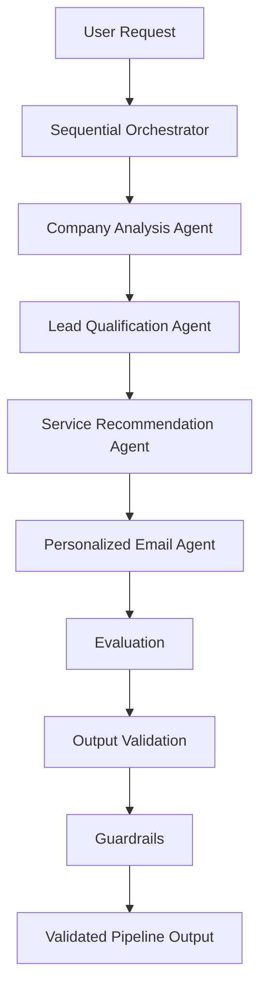

# Autonomous Outreach Agent

## Current System Architecture (v1)

## 1. System Overview

The Autonomous Outreach Agent is a multi-agent AI system designed to automate B2B sales outreach for Sanestix.

The system processes company information through a sequence of specialized AI agents, each responsible for a single task. Each agent produces structured outputs that are passed to the next stage of the pipeline. This modular architecture improves maintainability, extensibility, and separation of concerns.

The current implementation consists of four core AI agents orchestrated by a Sequential Orchestrator, followed by quality assurance components including Evaluation, Output Validation, and Guardrails.

## 2. Architecture Principles

The current system is designed around the following principles:

- **Modularity:** Each AI agent is responsible for a single task, making the system easier to maintain and extend.
- **Separation of Concerns:** Company analysis, lead qualification, service recommendation, email generation, and quality assurance are implemented as independent components.
- **Structured Communication:** Agents exchange structured schema-based outputs instead of unstructured text, ensuring consistency throughout the pipeline.
- **Sequential Orchestration:** The orchestrator coordinates the execution order of agents and manages the flow of data between them.
- **Quality Assurance:** Evaluation, Output Validation, and Guardrails verify the quality, correctness, and business compliance of the pipeline outputs.

## 3. High-Level Architecture

## 4. System Components

| Component | Responsibility | Input | Output |
|-----------|---------------|-------|--------|
| **Sequential Orchestrator** | Coordinates the execution of the AI pipeline and manages the flow of data between agents. | User request | Pipeline execution |
| **Company Analysis Agent** | Analyzes the company and extracts structured business information. | Company information | Company Analysis |
| **Lead Qualification Agent** | Evaluates whether the company is a qualified lead and assigns a score and priority. | Company Analysis | Lead Qualification |
| **Service Recommendation Agent** | Recommends AI services based on company analysis and lead qualification. | Company Analysis, Lead Qualification | Service Recommendations |
| **Personalized Email Agent** | Generates a personalized outreach email using previous agent outputs. | Company Analysis, Lead Qualification, Service Recommendations | Personalized Email |
| **Evaluation Framework** | Measures the quality and completeness of outputs produced by each agent. | Pipeline outputs | Evaluation Report |
| **Output Validation** | Validates schema compliance and ensures required fields are present. | Pipeline outputs | Validation Report |
| **Guardrails** | Enforces business rules and detects policy or workflow violations. | Pipeline outputs | Guardrail Report |

## 5. Pipeline Workflow

The current system follows a sequential execution model where each agent depends on the output of the previous agent.

1. The user submits a company name or company information.
2. The Sequential Orchestrator initiates the pipeline.
3. The Company Analysis Agent generates a structured company profile.
4. The Lead Qualification Agent evaluates the company and assigns a qualification score and priority.
5. The Service Recommendation Agent recommends AI services based on the company analysis and lead qualification.
6. The Personalized Email Agent generates a personalized outreach email using the previous outputs.
7. The Evaluation Framework assesses the overall quality of the pipeline outputs.
8. The Output Validation layer verifies schema correctness and required fields.
9. The Guardrails layer enforces business rules and policy constraints.
10. If all quality checks pass, the validated pipeline output is returned.

## 6. Current System Limitations

The current implementation successfully demonstrates a complete AI outreach pipeline.However, it is currently implemented as a proof-of-concept and has several limitations that affect production readiness and scalability.

### Current Limitations

- **No Persistent Memory:** The system does not retain information about previously processed leads or customer interactions.
- **No Customer History:** Previous outreach attempts, responses, and meetings are not stored, preventing personalized follow-ups.
- **Static Sequential Workflow:** Every request follows the same execution path regardless of the lead's state.
- **No Workflow Branching:** The orchestrator cannot route leads through different workflows (e.g., new lead, follow-up, meeting booked).
- **No State Management:** The pipeline does not maintain or track the lifecycle of a lead.
- **No External Data Storage:** Pipeline outputs exist only during execution and are not persisted in a database or CRM.
- **Limited Scalability:** The current architecture is suitable for sequential execution but is not optimized for handling large numbers of concurrent leads.

## 7. Conclusion

The current architecture provides a modular and maintainable AI pipeline for automated B2B outreach. The system separates responsibilities across specialized AI agents and incorporates evaluation, output validation, and guardrails to improve output quality and reliability.

While the current implementation successfully demonstrates the core AI workflow, additional architectural enhancements are required before the system is suitable for production deployment at scale.